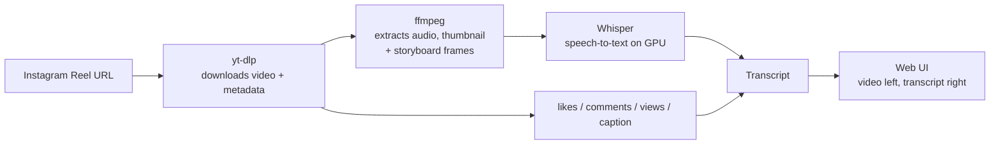

# Instagram Reel Transcriber

**Instagram Reel Transcriber** is a free, self-hosted tool that converts any Instagram Reel into an accurate text transcript — transcribed entirely on your own machine with [OpenAI Whisper](https://github.com/openai/whisper) (no paid transcription API, no upload limits), with reels, transcripts, and AI-generated analysis stored in a [Neon](https://neon.tech) Postgres database that you own and control.

Paste one or many Instagram Reel links, and for each one get:

- 🎬 The original video, playable inline
- 📝 A full speech-to-text transcript (powered by Whisper, GPU-accelerated)
- ❤️ Engagement stats — likes, comments, views
- 👤 Uploader handle and caption
- 💾 Automatic caching — every reel you've transcribed is saved to your database and loads instantly on repeat visits

If you're looking for a **free Instagram Reel transcriber**, a **Reels-to-text converter**, or a way to **bulk transcribe Instagram videos** for content research, repurposing, subtitles, or accessibility — this is built for exactly that.

## Why this instead of a paid transcription API?

| | Instagram Reel Transcriber | Typical paid transcription APIs |
|---|---|---|
| Cost | Free, runs on your hardware (+ a free Neon DB) | Per-minute billing |
| Privacy | Video/audio never leaves your machine; data lives in a Postgres DB you own | Video/audio uploaded to a third party |
| Rate limits | None | Monthly quota on free tiers |
| Speed | Seconds per reel on a GPU | Network round-trip + queueing |
| History | Your own database, browsable sidebar | Usually none |

## How it works



1. **[yt-dlp](https://github.com/yt-dlp/yt-dlp)** resolves the Reel URL to a direct video file and pulls post metadata (likes, comments, views, caption, uploader).
2. **ffmpeg** extracts a thumbnail for the history sidebar, plus up to 12 evenly spaced storyboard frames from the video (locally, no API involved).
3. **[OpenAI Whisper](https://github.com/openai/whisper)** transcribes the audio track locally — on your GPU if you have CUDA, otherwise CPU.
4. As soon as the transcript lands, the reel's AI passes run on their own — the visual breakdown first (it reads the storyboard frames), then the four-part script breakdown, which uses the scene structure the visual pass produced. Nothing to click.
5. Video/thumbnail/frame files are cached to local disk; transcript, metadata, and analysis are stored in your Neon Postgres database — so re-submitting a link you've already processed returns instantly instead of re-downloading and re-transcribing.

## Features

- **Batch input** — the dashboard composer turns each link into its own removable unit: press Enter (or paste a whole list at once) and every reel drops into a queue below the box, where you can pull any one back out before committing. Backspace on an empty box reopens the last unit for editing, duplicates and non-reel lines are called out instead of silently swallowed, and links already in the project are flagged as cache hits. Each submission then gets its own panel on the dashboard with a progress bar and a per-reel status tile (Queued / Downloading / Transcribing / Done / Failed), plus a matching group in the sidebar, until you dismiss it
- **Grouped history** — the sidebar list is split into In progress / Failed / Today / Yesterday / This week / This month / Earlier, so a long library stays scannable
- **Dashboard** — a landing view with aggregate stats (reels transcribed, total likes/comments/views) and your most recently transcribed reels, plus a non-blocking "processing in the background" indicator so batch jobs never get lost when you navigate away
- **Hands-off pipeline** — one click on **Analyze** takes each reel all the way through: download → transcribe → read the frames → break down the script. Only the cross-reel formula run on the Analysis page is manual, because it's a judgement call about when you have enough reels to compare
- **Live progress** — see each reel move through Downloading → Transcribing → Reading frames → Breaking down script → Done, with state tracked server-side so it survives page reloads
- **Catch-up on old reels** — reels transcribed before a pass existed are queued for it the first time you open the project, once per reel, so an old library fills itself in
- **Persistent history sidebar** — every transcribed reel is saved and browsable, with thumbnail, handle, and stats
- **Engagement metadata** — likes, comments, caption, plus **views and reshares** read from the endpoint Instagram's own web client uses, with the Instagram/Facebook play split and derived engagement-rate and reshares-per-1k-views figures (needs a logged-in session — see [View counts, reshares, and the cookies they need](#view-counts-reshares-and-the-cookies-they-need))
- **Timestamped transcripts** — toggle between plain text and a `[MM:SS]` timestamped script per reel, from Whisper's segment-level output
- **AI four-part breakdown** *(optional)* — split a transcript into Hook / Promise / Validation / CTA using your own OpenAI- or Anthropic-compatible API key, configured in-app and stored in your database
- **Storyboard frames** — every downloaded reel is sliced into up to 12 evenly spaced stills with timestamps, browsable as a grid; click any frame (or any scene, or any transcript timestamp) to jump the player there
- **Visual breakdown** *(optional)* — a vision pass over those frames that reads what actually happens on screen: the reel's scenes with their time ranges, what each beat is trying to do, hook type, on-screen text, how it's shot and edited, and why it holds attention. Surfaced as **Overview / Transcript / Breakdown / Scenes / Frames / Structure** tabs on each reel, with a colour-coded scene timeline under the player
- **Bulk CSV export** — export all transcribed reels to CSV with checkboxes for video link, metrics, timestamped script, and AI analysis
- **Analysis tabs** *(optional)* — a persistent, growing library of AI-generated hook/script/talking-style "formulas" (reusable pattern + rating + reasoning + evidence), built by comparing your highest- and lowest-engagement reels and accumulating/deduping across runs, backed by computed metrics like words-per-minute, filler-word density, and CTA position
- **Rate my script** *(optional)* — paste a draft and get it scored (0-100 plus hook / promise / body / CTA / clarity / retention / voice sub-scores, each pointing at a line), edited (the fewest changes with the biggest lift, each justified), and rewritten (a full Script card in one of six angles) — all against the project's own lever stats, playbook and top reels rather than generic creator advice
- **My Instagram + "My version"** *(optional)* — name your own account and every reel on it is listed with its counts; the newest are imported into a "My reels" project, and a study says what works on *your* account and what doesn't, with a style profile of how you talk in your best reels. Any reel in any project then has a **My version** tab: it researches the topic, drafts three scripts in your style, and [Jev](https://docs.typesafe.ai/models) scores each one for how much it sounds like you and whether it uses the shapes that win on your account
- **Creative Corner** — a per-project writing workspace for ideas and scripts: paste a loose thought or a complete draft, then let free local label detection (and a tightly rate-limited one-call AI fallback for unlabelled drafts) map Hook / Promise / Validation / CTA beside the writing canvas. Includes a wide drag-and-drop pipeline (Ideas → Scripting → Ready to film → Posted), sequenced field-level autosave, search, tags, duration, reference reels, full-board CSV download/device sharing, and an idea-aware bottom-right copilot that makes no chat call until you press Send
- **GPU-accelerated** — uses CUDA automatically when available for fast Whisper inference
- **One-click launch** — a `start.bat` script for Windows users to open the app without touching a terminal
- **No Instagram account required** — the AI breakdown and Analysis tabs are the only features that need an AI provider API key, and they're entirely optional (a Neon database is required for the app to run at all — see [Database setup](#database-setup) below)

## Requirements

- Python 3.10+
- [ffmpeg](https://ffmpeg.org/download.html) on your `PATH`
- A [Neon](https://neon.tech) Postgres database (free tier is enough) — see [Database setup](#database-setup) below
- (Optional but recommended) an NVIDIA GPU with CUDA for fast transcription — CPU works too, just slower

## Installation

```bash
git clone https://github.com/aashishpahwa/instagram-reel-transcriber.git
cd instagram-reel-transcriber

python -m venv venv
venv\Scripts\activate      # Windows
# source venv/bin/activate # macOS/Linux

pip install -r requirements.txt
```

### Database setup

1. Create a free project at [neon.tech](https://neon.tech) and copy its connection string.
2. Apply the schema once, either by pasting [`schema.sql`](schema.sql) into the Neon SQL editor, or via `psql "<your connection string>" -f schema.sql`.
3. Copy `.env.example` to `.env` and set `DATABASE_URL` to your connection string.

If you're migrating from an older local-JSON version of this app, run `python migrate_to_neon.py` once after the schema is applied to import your existing `data/store.json`/`data/settings.json` — it's idempotent, so re-running it is safe.

### Latency to Neon

Every round trip to Neon costs what the network costs (≈250 ms from India to a `us-west-2`
project), so the DB layer is built to spend as few as possible: reads run in autocommit (one
round trip; the cursor switches to a real transaction on the first write and commits at the
end), the liveness probe only runs on a connection that sat idle for 45 s, projects are cached
in memory for 60 s (every write path invalidates), and the per-request user mirror is done once
per process. `/api/jobs` touches the DB zero times per poll. If the app still feels slow, the
single biggest lever left is the Neon project's **region** — create the project in the region
nearest you (e.g. `ap-southeast-1` for India) and point `DATABASE_URL` at it.

### GPU acceleration (recommended)

The default `torch` install from `requirements.txt` is CPU-only. For GPU-accelerated transcription, install the CUDA build that matches your GPU/driver instead:

```bash
pip install torch --index-url https://download.pytorch.org/whl/cu128
```

(Swap `cu128` for whatever CUDA version your GPU/driver supports — see the [PyTorch install matrix](https://pytorch.org/get-started/locally/).)

## Deploying for a team

Want one shared instance instead of everyone running it locally? The repo ships a
[`Dockerfile`](Dockerfile), a [`docker-compose.yaml`](docker-compose.yaml) and a GitHub
Actions workflow that publishes the image to GitHub Container Registry on every push to
`master`. On a Hostinger VPS it is *Docker Manager -> Compose from URL -> paste this repo's
URL -> fill in the environment variables -> Deploy*; the same compose file works on any
Docker host. The cloud image has no GPU and no local Whisper: transcription goes through
Groq's hosted Whisper, so `PLATFORM_GROQ_API_KEY` is effectively required there.

Step-by-step, including the Neon Auth domain setting, what to send the team, and how to
ship updates: [docs/deploy-hostinger.md](docs/deploy-hostinger.md).

## Usage

```bash
python app.py
```

Then open **http://localhost:5151**, paste an Instagram Reel URL into the composer on the dashboard and press Enter (repeat, or paste a list, to queue several), then click **Transcribe**. (From anywhere else in the app, the **Add reels** button at the top of the sidebar takes you back to it.)

Windows users can instead just double-click `start.bat` to launch the server and open the browser automatically.

## Configuration

The Whisper model size is set in `app.py`:

```python
_whisper_model = whisper.load_model("small", device="cuda")
```

Swap `"small"` for `"medium"` or `"large-v3"` for higher transcription accuracy (at the cost of more VRAM and slower inference), or `"tiny"`/`"base"` for maximum speed on modest hardware.

### AI breakdown (optional)

Click the ⚙ icon in the sidebar to configure an AI provider for the Hook / Promise / Validation / CTA breakdown:

- **Provider:** OpenAI-compatible or Anthropic-compatible — pick whichever matches your key, or point Base URL at any compatible proxy
- **Storage:** saved to the `settings` table in your Neon database, never committed to this repo — but note it does leave your machine to the extent your database does; if that matters to you, use a restricted/low-spend API key

This step is entirely optional; transcription, the dashboard, and CSV export all work without it.

### Storyboard frames and the visual breakdown

Frames are pulled with ffmpeg the moment a reel finishes downloading — that's local work with no API cost, so every reel gets them. Reels transcribed before this feature existed have an **Extract frames** button on their Frames tab.

**Analyze visuals** on a reel sends those frames (up to 10, evenly spaced, first and last always included) plus the timestamped transcript to your configured AI provider, which returns a frame-grounded read of the video:

- **Scenes** — the video split into its beats (Hook, Tip 1, CTA, …) with start/end times, what each beat is *for*, and what's visible in it
- **Structure** — the same beats stated as a reusable skeleton: goal + beat per step
- **Overview** — hook type, the structure as a chip flow, visual opening, on-screen text quoted verbatim, key topics, and why the video works
- Shot/setting/editing notes, used as context by the other AI passes

Because this one sends images, it needs a vision-capable model (e.g. `gpt-5.6-luna` - the default - `gpt-4o`, or a Claude model). It costs API tokens, so it never runs automatically — you trigger it per reel, or in bulk from the Analysis page via the **Watch videos for scenes & visuals** checkbox, which states how many reels haven't been watched yet before you run it.

Once a reel has been watched, its scene structure feeds the other two AI passes: the four-part breakdown uses it to place part boundaries, and formula analysis gets each reel's beat skeleton, hook type and on-screen text — so formulas can be about how a reel is *built and shot*, not just what was said.

### Bulk CSV export

The **Export CSV** button in the sidebar lets you choose which columns to include — video CDN link, metrics, timestamped script, and/or AI analysis — and downloads a CSV of every reel you've transcribed. Note that Instagram's CDN video links are signed and expire after a few hours, so treat that column as a snapshot rather than a stable link.

### Analysis tabs

The **Analysis** page runs a second AI pass across every transcribed reel at once, maintaining
a persistent library of reusable "formulas" rather than a one-off report. Each formula is a
literal fill-in-the-blank template ("Here are [number] [things] that [surprising outcome]")
plus a rating, a reason, and the specific reels it was seen in — click any evidence reel to
jump straight to it.

Three things make the output trustworthy rather than plausible:

**Tiers are absolute, based on views.** `GOOD_VIEW_THRESHOLD` (default 50k) and
`AMAZING_VIEW_THRESHOLD` (default 1M) decide them, and you should set both to whatever "did
well" means for the accounts you track. Two earlier approaches were wrong and are worth
recording: fixed thresholds on likes+comments put 34 of 37 reels in "amazing", giving the
model no contrast at all; ranking on engagement rate instead inverted reality, labelling a
13.3M-view reel "good" and a 46k-view reel "amazing". Rate measures how well a reel converted
the reach it got, not how much reach it got — so it's reported per reel as a separate signal,
and the tier is decided by views. A batch can legitimately be all one tier; that's a finding,
not a problem to correct for.

**One focused pass per category, over chunks of ~12 reels.** A single call covering every
category and every reel has to split one output budget across all of them, and reliably
answers with two or three formulas for a forty-reel library. Chunking also fixes coverage: a
model handed forty reels skims and cites the two it noticed, while a dozen is few enough to
work through one by one. Formulas found earlier in a run are fed forward into later chunks so
they get reused by name instead of re-coined as near-duplicates, and chunks are dealt
round-robin off the ranked list so each holds a spread of strong and weak reels.

**Citations are verified against the reel.** Every quote in a breakdown is matched against
that reel's own transcript, analysis and on-screen text. The model will otherwise attach one
reel's words — or invented words — to another reel's id, which is how a formula ends up
showing an example that plainly doesn't match. Citations whose wording isn't found in the reel
they name are discarded before anything is written, and the run reports how many of your reels
ended up cited.

Every run reconciles against the existing library: recurring patterns get their rating and
evidence updated and a `times_seen` counter bumped, genuinely new ones get added — so the
library grows and self-corrects instead of resetting. It needs at least 6 reels with an AI
breakdown. Views and reshares are fetched too, so the comparison is on engagement *rate* and
reshares per 1k views rather than raw counts — but a formula is still a correlation across a
small sample, so treat them as directional, not definitive.

### Levers, contrast pairs and the playbook

The **Levers** tab on the Analysis page is the deterministic half of group analysis — no model
involved, so it never hallucinates and it improves with every reel. For every taxonomy value
shared by at least 3 tagged reels it shows n, the median reach multiple / sends per 1k /
engagement, the **lift** of each over the library median, the breakout rate, a confidence
from n, and the top example reels (`levers.py`, `GET /api/analysis/levers`). Below it:
**contrast pairs** — reels sharing a hook type, structure or topic that landed >3× apart on
reach, with the tag differences between them — and your own account's baseline and voice
profile when the project has a handle.

The formula run now reads those numbers: each category's prompt is seeded with the relevant
lever stats and contrast pairs, every formula declares the taxonomy `levers` it is made of,
and `effect` / `lift` are **measured** from the cited reels against the library (never
model-rated; `working / not_working` follows the measured effect when there are numbers).
Targets per chunk are one formula per 3–4 reels, and a conservative **consolidation pass**
per category (`POST /api/analysis/consolidate`) merges same-shape formulas that separate
chunks coined under different names — union of evidence, best name/template kept.

Each run ends by rewriting the project's **playbook** (`projects.playbook`,
`GET/POST /api/analysis/playbook`): 250–400 words of "what works here, with numbers", every
claim tied to a lever stat or a formula id. It is shown at the top of the Analysis page and is
the first thing the agent reads.

### The Reel agent (in-app)

The agent is reachable two ways inside the app. The floating **✦ Ask agent** button (bottom-right,
on every page once signed in) opens a slide-over drawer — open a reel first and the drawer knows
it: "this reel", "it", "what would you change?" resolve to the one on screen (its id, creator,
numbers and hook line are put in front of the model for that turn), with quick prompts for
"why did this reel do what it did", "write a reel like this", "what would you change". The
drawer and the page share the same conversations; **Expand** jumps to the full page.

The **Agent** page (left nav) is the same agent inside the app: conversations per project,
a streamed turn that shows each tool call as a chip ("search reels · 12 of 38 results",
"lever stats · 4 levers") before the answer lands, reel ids in answers that open the reel,
`[F12]` references that jump to the formula, starter prompts, and a **Saved drafts** view that
renders scripts the agent saved as Script cards (hook / promise / beats / CTA / on-screen text
/ caption / levers / why / expected signals) with one-click copy.

It runs on the account's configured provider (`agent/runtime.py`): OpenAI GPT-5-family models
go through `/v1/responses` (function tools + reasoning; the chain is continued with
`previous_response_id` across tool rounds), other OpenAI-compatible models through
`/chat/completions`, Anthropic through `/v1/messages` `tool_use`. Up to 8 tool rounds per turn,
tool results trimmed to ~7k chars each, the last 40 messages replayed. Every user message,
assistant message (with its tool calls), and tool result is stored in `agent_threads` /
`agent_messages`, so a thread can be reopened and audited. The system prompt is
`agent/prompts.py` plus a live project snapshot (counts, baselines, thresholds, data caveat),
the playbook, saved notes and the project instructions.

**Research.** On OpenAI GPT-5-family models the agent gets OpenAI's hosted `web_search` tool
automatically (server-side, cited by URL, shown as a chip); searches show up as `web_search`
chips and sources are appended under the answer. For any model, Settings → **Agent web
research** adds a provider of your choice — Tavily, LangSearch or Brave — as the
`web_research` tool (per-account key, or a platform `TAVILY_API_KEY` / `LANGSEARCH_API_KEY` /
`BRAVE_API_KEY` in `.env`). The operating instructions tell it to fact-check a claim before
writing a script on it and to keep unverifiable claims hedged.

Endpoints: `GET/POST /api/agent/threads`, `GET/DELETE /api/agent/threads/<id>`,
`POST /api/agent/threads/<id>/messages` (SSE: `status`, `tool_call`, `tool_result`, `message`,
`usage`, `error`, `end`), `GET/POST /api/agent/drafts`, `GET /api/agent/drafts/<id>`, `GET/POST /api/agent/notes`.

### Rate my script

The **Rate my script** page (left nav) is a three-tab editor for a draft you haven't posted yet.
Paste the script (title and goal optional) and:

- **Rate** — `POST /api/script/rate` returns a 0-100 score, a band (weak / ok / good / strong), seven
  sub-scores with a note that quotes the line it is about, what a viewer gets in the first three
  seconds, strengths and weaknesses, predicted watch-time / likes / sends, the one edit worth making
  first, and the taxonomy tags the draft pulls with this library's n and lift for each (the same
  deterministic matching the agent's `tag_text` tool does). The Rate tab goes stale the moment you
  edit the script, and says so.
- **Improve** — `POST /api/script/improve` is an edit pass: keeps the idea, structure and voice,
  returns 3-7 line-level changes (from → to → why, each naming a lever, reel or platform signal), the
  full improved script, what it left alone on purpose, and what an edit can't fix. **Use as my
  script** swaps it into the editor so you can re-rate.
- **Rewrite** — `POST /api/script/rewrite` rebuilds it around what travels in the library, in one of
  six angles (best shot, shorter, contrarian lead, story-led, numbered beats, built for sends) and an
  optional target duration. Comes back as the agent's Script card (hook, promise, beats, CTA,
  on-screen text, caption, levers, why, expected signals) plus a read-aloud version; **Save as
  draft** (`POST /api/agent/drafts`) files it under Agent → Saved drafts.

Every call is grounded in the same context the agent reads first — project instructions, playbook,
the lever table, the top reels by reach with their hook lines and tags, the creator's own baseline
and voice profile, and the algorithm brief — and the prompts ban the generic advice ("post
consistently", "make the hook more engaging"). Results are kept per project in the browser, so a
reload or a hop to another page doesn't lose them; nothing is stored server-side.

### My Instagram, "My version", and Jev

**Jev** is TypeSafe AI's System One model. It does not write: it reads one piece of state and answers typed questions about it - `choice` (one label from a closed set), `score` (a position on an ordered rubric), `noul` (a yes/no probability) - each with calibrated probabilities, in well under a second, for a fraction of a cent. That is the exact shape of this app's closed taxonomy, so the work is split three ways:

| Layer | Does | Never does |
|---|---|---|
| **Jev** (`jev.py`) | Tags reels against the taxonomy; judges rewrite candidates against your style | Write text, count, do arithmetic, compare dates |
| **The LLM** | Diagnoses, the account study, the rewrites themselves | Decide what "winning" means |
| **Code** (`levers.py`, `_listing_baseline`) | Lifts, medians, bands, the 0-100 rewrite total | - |

Set a key in **Settings -> Jev API key**, or platform-wide with `TYPESAFE_API_KEY`. With no key anywhere every Jev step is skipped and the app runs on the LLM alone, exactly as before. Jev is called over plain `requests` (`POST https://api.typesafe.ai/v1/systemone`), like every other provider here.

**In the Reel Card.** After the LLM returns tags + diagnosis, Jev re-judges every closed dimension and the four 1-5 scores (23 questions, one call). A Jev answer replaces the LLM's only at confidence >= 0.5 and never when it picks `other` (which needs a written note); `hook.devices` is one `noul` per device, kept at p >= 0.6. What Jev can't produce (topic, the two numbers, `other_notes`) stays the LLM's. The card shows Jev's median confidence, what it was unsure of, and where it overrode the model (`tags.jev`). A Jev outage just leaves the LLM's tags.

**My Instagram** (left nav). Enter your handle - no password, no login; the listing is read with the same Instagram session the app already downloads with, so the account has to be public. `POST /api/me/connect` lists up to 300 reels with their counts (`creator_profiles.listing`), creates a `My reels - @handle` project with the handle set as its own account, and queues the newest N (default 30, max 100) through the ordinary pipeline. Older reels can be imported one by one from the table. The account-wide numbers - median views, p10/p90, posts per week, views by length and by weekday - are computed over the *whole* listing, not just the imported sample.

**Study my reels** (`POST /api/me/study`, needs 6 carded reels) Jev-tags any reel that hasn't been, builds the lever table against your own median, and has the LLM write what works, what doesn't, context outliers (collabs, paid partnerships), what you've barely tried, the next five reels, and a **style profile** (voice, signature moves, vocabulary, what you never say, hook / structure / CTA habits, real example lines). Reel ids the model cites are checked against the project and dropped if invented. The `winning` / `losing` shapes on the profile come from the lever table (n >= 3, lift >= 1.25 / <= 0.8), not from the model.

**My version** (a tab + toolbar button on every reel, any project; `POST /api/reels/<id>/rewrite`). Takes the reel's *idea*, never its sentences. One or two live searches on the topic (your configured search provider; skipped cleanly without one - then no new factual claims are allowed), one LLM call for three candidates with different hook shapes in your style, then Jev judges each candidate in parallel: sounds-like-you, hook, clarity, specificity, whether hook/structure/CTA land on your winning shapes, and two penalties (generic AI tone, padding). The 0-100 total is a weighted sum computed in code; candidates are shown best first. A cited URL must be one the search actually returned. Results are kept in `reel_rewrites`; any candidate can be saved to the drafts list.

Schema: `migrations/008_my_instagram_jev.sql`.

### The Reel agent (MCP server)

`agent/` is one tool layer over the library with two front doors; the first, shipped now, is
an **MCP server** for Claude Code / Claude Desktop:

```bash
claude mcp add reel-agent -e MCP_USER_ID=<your app_users.id> -e MCP_PROJECT_ID=<project id> -- D:/ReelTranscriber/venv/Scripts/python.exe -m agent.mcp_server
```

(Run from the repo root; `.env` is loaded for `DATABASE_URL`. Your user id is the `sub` of
your Neon Auth session — `select id, email from app_users` — and the project id is in the
URL of the project switcher.) Tools: `get_project_overview` (start here: baselines, playbook,
notes, data caveat), `search_reels`, `get_reel`, `similar_reels`, `compare_reels`,
`lever_stats`, `contrast_pairs`, `get_formulas`, `own_baseline`, `algorithm_brief`,
`tag_text` (tag a draft + predicted-lift sketch), `analyze_url` (diagnose any reel link
**without** saving it — see below), `ingest_reel` (save one), `web_research` (only with
`TAVILY_API_KEY` or `BRAVE_API_KEY`), notes and drafts. The `reel-agent` prompt carries the
operating instructions (`agent/prompts.py`): numbers first, cite reel/formula ids, admit thin
data, no generic advice, structured Script cards. Schemas live in `agent/schemas.py` and are
shared with the in-app runtime (next phase), so both doors behave the same.

#### Diagnosing a reel you don't want to keep (`analyze_url`)

Most links you paste at the agent — a competitor's reel, one of your own that flopped — are
questions, not references. `analyze_url` runs the identical pipeline as `ingest_reel`
(download → transcript → frames → visual pass → four-part breakdown → Reel Card) and ranks
the result against the project's library (reach multiple, percentile, sends per 1k, outcome
band), but the working copy is a **scratch reel**: `persist_reel()` skips both the database
and `store_cache` for it, so it never appears in the library, the CSV exports, the lever
statistics or a formula run, and its percentile is "where it would sit" rather than a new
entry. Scratch reels live in memory only, carry a `~` in their id (a character no Instagram
shortcode contains, so they can never collide with the saved copy of the same reel), and are
dropped with their media after six hours, after twenty of them, or at the next restart.

The tool blocks up to ~90s waiting for the pipeline and returns `ready: false` if it needs
longer; calling it again with the same URL keeps waiting on the same job. Use `ingest_reel`
when the reel should actually join the library.

Both accept either URL shape Instagram hands out — `instagram.com/reel/<code>/` and the
share-sheet's `instagram.com/<username>/reel/<code>/` — as do the Add composer and the
view-count lookup.

### The Reel Card (tags + diagnosis)

After the four-part breakdown, every reel gets a **Reel Card** — one more text call that
tags the reel against a closed vocabulary and diagnoses its numbers. It runs automatically
(visual → breakdown → card), in bulk from the Analysis page's prepare step, or by hand from the
reel's **Reel card** tab (`POST /api/card/<id>`).

- **Tags** (`reels.tags`) come from `taxonomy.py`: hook type and devices, promise, structure,
  CTA type/position, format, captions, energy, audience awareness, primary emotion, plus 1–5
  judgement scores (specificity, novelty, clarity, hook strength), two estimated numbers
  (seconds to first payoff, re-hook count), topic, and two derived bands (WPM, duration). The
  lists are closed so tags can be counted and compared across reels, projects and niches; a
  model that picks `other` must say what it meant in `other_notes`, which is how the taxonomy
  grows on purpose. Unknown slugs are dropped at validation, never stored. `taxonomy_v` is
  stamped on every card.
- **Diagnosis** (`reels.diagnosis`): a number-first one-liner ("92k views = 0.09× followers,
  p11 in this library, 0.5 sends/1k — under-reached — …"), what drove it and what held it
  back as *lever → platform signal* items with verbatim quotes (checked against the reel and
  dropped if absent), a read of the watch-time / likes / sends signals, one concrete change,
  and a confidence. Generic advice is banned by the prompt; the quality of the reasoning
  scales with the model you configure in Settings — `gpt-4o-mini` tags reliably but diagnoses
  thinly; the default `gpt-5.6-luna` gives causal, specific diagnoses at a similar price.
- The prompt sees the reel's project-relative metrics (reach multiple, percentiles, outcome
  band), the creator's follower count, the caption, the visual summary, the algorithm brief,
  and — for your own reels — the **Instagram Insights** you enter on the card tab
  (`PATCH /api/reels/<id>/insights`: plays, reach, non-follower %, average watch time, 3-second
  retention, completion, sends, saves, profile visits, follows, note). Those private numbers
  outrank every public proxy in the diagnosis.

`/api/jobs` now attaches `metrics` to every done reel (the same project-relative numbers the
Analysis page uses), and the formula run receives each reel's tags and diagnosis one-liner, so
formulas can be stated in the taxonomy's terms.

### Creators, reach multiple, and "your" reels

Raw views mostly measure how big the creator already is, so every reel's creator is looked
up once and cached in a `creators` table (follower / following / post counts, refreshed weekly).
The follower count in force at fetch time is snapshotted into the reel's `meta`, and
`compute_metrics()` derives **reach multiple = views ÷ followers**: a 3× reel from a 40k
account and a 3× reel from a 4M account did the same thing, and a 0.2× reel from a huge
account did not "work" however large its view count. The reel page shows followers and reach
multiple next to the engagement rate; the Analysis overview table has Followers and Reach×
columns; the CSV export carries both.

The profile lookup uses the same logged-in session as view counts. Instagram's JSON profile
endpoint answers HTTP 400 for some business accounts (an Instagram-side schema error), in
which case the app falls back to the public profile page's `og:description` ("53K Followers,
…") fetched anonymously — approximate, but a fine denominator.

Each project has two new settings (project modal):

- **Your Instagram handle** — reels from that account are marked `source = 'own'`; everything
  else is a reference reel. Changing the handle re-marks the whole project. This is the split
  the "why didn't my reel work" comparisons need.
- **How "did well" is decided** — `views` (the default: absolute thresholds, 50k+ did its job)
  or `reach` (reach-multiple bands: ≥3× breakout, ≥1× above, ≥0.3× baseline, else below;
  `REACH_*_MULTIPLE` env vars). This decides the `outcome_band` shown per reel and handed to
  the formula prompt, alongside project-wide percentiles for views, reach, engagement rate and
  reshares/1k, and a within-creator percentile when three or more of one creator's reels are
  in the library.

Captions and hashtags are captured on the same stats fetch (`reels.caption`, `reels.hashtags`)
— the caption is the text hook and the topic signal. `migrations/003_analysis_v2.sql` adds all
of this plus the columns the next phases write (`tags`, `diagnosis`, `insights` on reels;
`levers`, `effect`, `lift` on formulas). The roadmap is in `docs/analysis-v2-plan.md`.

### Algorithm context (`research/`)

Formula analysis is stronger when it knows what the platform actually rewards, so the app
feeds it a researched brief about Instagram's Reels distribution alongside your reels.

- **`research/instagram-algorithm.agent.md`** is the brief a research agent follows: what
  counts as in scope, the source tiers (Tier 1 Instagram/Meta primary, Tier 2 trade press,
  Tier 3 Reddit and creator communities), how to handle Reddit when it's blocked, the exact
  output format, and the rules about never presenting community anecdote as mechanics.
- **`research/instagram-algorithm.md`** is the living file it maintains. The app parses it
  at request time — edit it and the next analysis picks it up, no restart.

A local scheduled task (`instagram-algorithm-research`) runs the review on the 1st of each
month; if the app isn't running then, it runs at next launch. You can also run it by hand
any time by pointing an agent at the brief.

Sections `Current model`, `Ranking signals`, `What suppresses reach`, `Format guidance`,
`Community signal` and `Open questions` are injected into the formula prompt, explicitly
framed as background that must never override what your own reels show. `Sources` and
`Superseded` are deliberately kept out of the prompt and shown in the UI instead — the
Analysis page's **Algorithm context** panel lists every source with its tier and date, so
you can see exactly what the AI was told and check it yourself.

Until the first research run, the file is an empty skeleton, nothing is injected, and the
panel says so — an un-researched brief must never look like a researched one.

### View counts, reshares, and the cookies they need

yt-dlp gives us likes and comments but no view count for reels — verified against the
current build, which returns `like_count` and `comment_count` and nothing view-shaped. Every
anonymous route is also closed now: `/api/v1/media/.../info/` serves a login wall,
`graphql/query` returns 403, and the reel page embeds no counts.

The numbers *are* readable from the endpoint Instagram's own web client uses,
`/api/v1/media/<media_id>/info/`, with the same session cookies this app already uses to
download. The shortcode in a reel URL is the media id in base64, so no extra lookup is
needed. One read-only GET per reel, throttled to one call every 1.5s process-wide.

What comes back — outcomes, and the choices behind them:

| field | meaning |
|---|---|
| `play_count` | what the app shows as **views** — equals `ig_play_count + fb_play_count` |
| `ig_play_count` / `fb_play_count` | the Instagram / Facebook split for cross-posted reels |
| `media_repost_count` | **reshares** — the "sends" signal Instagram weights most for reaching non-followers |
| `like_count` / `comment_count` + `fb_*` | engagement, with the Facebook side broken out |
| `taken_at` | the real post time, so day-of-week and hour become analysable |
| `original_width` / `original_height` | resolution — the platform is documented to give low-res reels less reach |
| `video_duration` | authoritative length (the transcript stops at the last spoken word) |
| `clips_metadata.audio_type` + track title/artist | original audio vs a licensed track, and which |
| `coauthor_producers`, `is_paid_partnership` | collabs and sponsorships, which explain outliers |
| `gen_ai_detection_method` | Instagram's own AI-content determination |
| `like_and_view_counts_disabled` | whether the creator hid their counts |

From those the app derives **engagement rate**, **reshares per 1k views**, `is_full_hd`,
`is_original_audio`, `posted_dow` / `posted_hour_utc`, `is_collab` and `cross_posted_to_fb`,
and hands all of them to the formula analysis. Rates matter more than totals: a 400k-view
reel and a 10M-view reel aren't comparable on raw counts, and per the algorithm brief the
platform ranks on rates too. Timing is deliberately labelled UTC — the creator's own timezone
is unknown, and a day-of-week finding drawn from the wrong clock is worse than none.

Reels fetched before a field existed are topped up automatically, once per reel per process,
the first time you open the project. The trigger is a `stats_v` stamp in each reel's meta
rather than any single field, so adding a field to `parse_media_item()` and bumping
`STATS_VERSION` re-runs the backfill across the whole library by itself.

**This needs a logged-in Instagram session** — the same `YTDLP_COOKIES_FILE` /
`YTDLP_COOKIES_FROM_BROWSER` config used for downloading. Without a `sessionid` cookie the
fetch is skipped and reels simply have no view count; nothing else breaks.

**Refreshing the session from the UI.** Settings → **Instagram session cookies** takes a
Netscape cookies.txt export, a cookie-editor JSON export, a `Cookie:` header copied from
DevTools, or just the `sessionid` value. It's saved to `data/instagram_session.txt`, takes
effect immediately (no restart), and outranks every env-configured source until you remove
it there. It's one session for the whole instance, not per user. A pasted session for a
different account than `INSTAGRAM_ACCOUNT_ID` is rejected.

**Use a throwaway account, and pin it.** That cookie is a bearer credential for a real
Instagram account, and automated traffic against the private web API is what rate limiting
and suspensions exist to catch. Reading cookies live from a browser also means the app
follows whoever happens to be logged in there — so log in as the throwaway and set
`INSTAGRAM_ACCOUNT_ID` to its numeric `ds_user_id`. With that pinned, the app refuses to
download or fetch counts under any other account instead of silently switching to your main
one the next time you log in there. A mismatch fails the job with an explicit message rather
than acting as the wrong account.

The volume here is deliberately low (one GET per reel, spaced 1.5s apart), but if you'd
rather carry no account risk at all, the official path is the Graph API's
[Business Discovery](https://developers.facebook.com/docs/instagram-platform/instagram-graph-api/reference/ig-user/business_discovery/)
endpoint, whose `view_count` field is documented as reels-only and Business-Discovery-only —
it needs a Meta app, `instagram_manage_insights`, and the target account to be a Professional
account, and it's capped at 200 calls/hour/user.

The cookie is read at request time, sent only to instagram.com, and never written to the
database or the logs.

## Tech stack

- **Backend:** Python, Flask
- **Database:** Postgres via [Neon](https://neon.tech), accessed with `psycopg2`
- **Video/metadata extraction:** yt-dlp
- **Audio processing:** ffmpeg
- **Speech-to-text:** OpenAI Whisper (PyTorch, CUDA-accelerated)
- **AI breakdown, visual breakdown & formula analysis:** any OpenAI- or Anthropic-compatible chat completions API, via `requests` (the visual breakdown additionally needs a vision-capable model)
- **Frontend:** vanilla HTML/CSS/JS — no build step, no framework
- **Algorithm research:** a scheduled agent run against `research/instagram-algorithm.agent.md`, writing a markdown brief the app parses at request time

## Disclaimer

This tool downloads publicly accessible Instagram content on your behalf, for personal transcription and research use. You're responsible for complying with Instagram's Terms of Service and applicable copyright law in how you use downloaded content and transcripts. This project isn't affiliated with, endorsed by, or sponsored by Instagram or Meta.

## License

[MIT](LICENSE)
