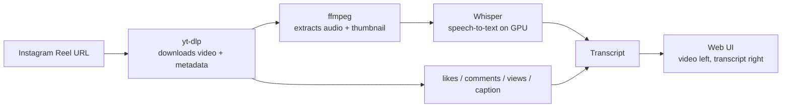

# Instagram Reel Transcriber

**Instagram Reel Transcriber** is a free, self-hosted tool that converts any Instagram Reel into an accurate text transcript — running entirely on your own machine with [OpenAI Whisper](https://github.com/openai/whisper), no paid API, no upload limits, and no data leaving your computer.

Paste one or many Instagram Reel links, and for each one get:

- 🎬 The original video, playable inline
- 📝 A full speech-to-text transcript (powered by Whisper, GPU-accelerated)
- ❤️ Engagement stats — likes, comments, views
- 👤 Uploader handle and caption
- 💾 Automatic caching — every reel you've transcribed is saved locally and loads instantly on repeat visits

If you're looking for a **free Instagram Reel transcriber**, a **Reels-to-text converter**, or a way to **bulk transcribe Instagram videos** for content research, repurposing, subtitles, or accessibility — this is built for exactly that.

## Why this instead of a paid transcription API?

| | Instagram Reel Transcriber | Typical paid transcription APIs |
|---|---|---|
| Cost | Free, runs on your hardware | Per-minute billing |
| Privacy | Nothing leaves your machine | Video/audio uploaded to a third party |
| Rate limits | None | Monthly quota on free tiers |
| Speed | Seconds per reel on a GPU | Network round-trip + queueing |
| History | Local cache, browsable sidebar | Usually none |

## How it works



1. **[yt-dlp](https://github.com/yt-dlp/yt-dlp)** resolves the Reel URL to a direct video file and pulls post metadata (likes, comments, views, caption, uploader).
2. **ffmpeg** extracts a thumbnail for the history sidebar.
3. **[OpenAI Whisper](https://github.com/openai/whisper)** transcribes the audio track locally — on your GPU if you have CUDA, otherwise CPU.
4. Everything is cached to disk, so re-submitting a link you've already processed returns instantly instead of re-downloading and re-transcribing.

## Features

- **Batch input** — paste multiple Instagram Reel links at once, one per line; a submitted batch shows as its own group in the sidebar until you dismiss it, separate from your general history
- **Dashboard** — a landing view with aggregate stats (reels transcribed, total likes/comments/views) and your most recently transcribed reels, plus a non-blocking "processing in the background" indicator so batch jobs never get lost when you navigate away
- **Live progress** — see each reel move through Downloading → Transcribing → Done, with state tracked server-side so it survives page reloads
- **Persistent history sidebar** — every transcribed reel is saved and browsable, with thumbnail, handle, and stats
- **Engagement metadata** — like count, comment count, and caption pulled alongside the transcript (view count is intentionally left unavailable — see [Why no view count?](#why-no-view-count) below)
- **Timestamped transcripts** — toggle between plain text and a `[MM:SS]` timestamped script per reel, from Whisper's segment-level output
- **AI four-part breakdown** *(optional)* — split a transcript into Hook / Promise / Validation / CTA using your own OpenAI- or Anthropic-compatible API key, configured locally in-app and never committed to this repo
- **Bulk CSV export** — export all transcribed reels to CSV with checkboxes for video link, metrics, timestamped script, and AI analysis
- **GPU-accelerated** — uses CUDA automatically when available for fast Whisper inference
- **One-click launch** — a `start.bat` script for Windows users to open the app without touching a terminal
- **No account required to transcribe** — the AI breakdown is the only feature that needs an API key, and it's entirely optional

## Requirements

- Python 3.10+
- [ffmpeg](https://ffmpeg.org/download.html) on your `PATH`
- (Optional but recommended) an NVIDIA GPU with CUDA for fast transcription — CPU works too, just slower

## Installation

```bash
git clone https://github.com/aashishpahwa/instagram-reel-transcriber.git
cd instagram-reel-transcriber

python -m venv venv
venv\Scripts\activate      # Windows
# source venv/bin/activate # macOS/Linux

pip install -r requirements.txt
```

### GPU acceleration (recommended)

The default `torch` install from `requirements.txt` is CPU-only. For GPU-accelerated transcription, install the CUDA build that matches your GPU/driver instead:

```bash
pip install torch --index-url https://download.pytorch.org/whl/cu128
```

(Swap `cu128` for whatever CUDA version your GPU/driver supports — see the [PyTorch install matrix](https://pytorch.org/get-started/locally/).)

## Usage

```bash
python app.py
```

Then open **http://localhost:5151**, paste one or more Instagram Reel URLs into the sidebar, and click **Transcribe**.

Windows users can instead just double-click `start.bat` to launch the server and open the browser automatically.

## Configuration

The Whisper model size is set in `app.py`:

```python
_whisper_model = whisper.load_model("small", device="cuda")
```

Swap `"small"` for `"medium"` or `"large-v3"` for higher transcription accuracy (at the cost of more VRAM and slower inference), or `"tiny"`/`"base"` for maximum speed on modest hardware.

### AI breakdown (optional)

Click the ⚙ icon in the sidebar to configure an AI provider for the Hook / Promise / Validation / CTA breakdown:

- **Provider:** OpenAI-compatible or Anthropic-compatible — pick whichever matches your key, or point Base URL at any compatible proxy
- **Storage:** saved to `data/settings.json`, which is git-ignored — your key never leaves your machine and is never committed to this repo

This step is entirely optional; transcription, the dashboard, and CSV export all work without it.

### Bulk CSV export

The **Export CSV** button in the sidebar lets you choose which columns to include — video CDN link, metrics, timestamped script, and/or AI analysis — and downloads a CSV of every reel you've transcribed. Note that Instagram's CDN video links are signed and expire after a few hours, so treat that column as a snapshot rather than a stable link.

### Why no view count?

Every free path to Instagram Reel view counts — yt-dlp, Instaloader, and even the private-API library `instagrapi` — requires authenticating as a real Instagram account; Instagram doesn't expose that field to anonymous requests. Rather than asking for your Instagram login (and the ban/challenge risk that comes with automating a private API), this tool leaves `view_count` unavailable. Likes, comments, and captions are unaffected.

## Tech stack

- **Backend:** Python, Flask
- **Video/metadata extraction:** yt-dlp
- **Audio processing:** ffmpeg
- **Speech-to-text:** OpenAI Whisper (PyTorch, CUDA-accelerated)
- **AI breakdown:** any OpenAI- or Anthropic-compatible chat completions API, via `requests`
- **Frontend:** vanilla HTML/CSS/JS — no build step, no framework

## Disclaimer

This tool downloads publicly accessible Instagram content on your behalf, for personal transcription and research use. You're responsible for complying with Instagram's Terms of Service and applicable copyright law in how you use downloaded content and transcripts. This project isn't affiliated with, endorsed by, or sponsored by Instagram or Meta.

## License

[MIT](LICENSE)
